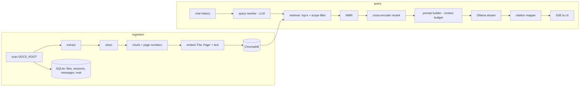

# 💬 RAG Doc Chatbot

Chat with the documents in a local folder. Answers are generated by a **local LLM (Ollama)** *only* from retrieved
passages, stream in live, and carry **clickable citations** `[1][2]` that open the exact chunk, page and file.
A **Debug** view shows the rewritten query, retrieved chunks with scores, the final prompt, token usage and timings,
and an **evaluation harness** measures retrieval hit-rate / MRR and (optionally) LLM-judged answer quality.
No cloud, no paid APIs.

> Project 4 of 5 · teaches the whole Retrieval-Augmented Generation pipeline and how to debug and evaluate it.

| Chat + sources | Debug | Evaluation |
|---|---|---|
| _screenshot placeholder_ | _screenshot placeholder_ | _screenshot placeholder_ |

## Architecture



## Prerequisites
- Python 3.11+, Node 20+
- [Ollama](https://ollama.com): `ollama serve`, then `ollama pull llama3.2:3b`
- Recommended: `pip install sentence-transformers` (real embeddings and the optional reranker). Without it the app falls back to
  a lexical *hashing* embedder and the Settings page tells you. After installing it, run **Force full re-index**.

## Quick start (Windows PowerShell)
```powershell
git clone https://github.com/kamalnathmurugan14/rag-doc-chatbot; cd rag-doc-chatbot
ollama pull llama3.2:3b
cd backend
python -m venv .venv; .\.venv\Scripts\Activate.ps1
pip install -r requirements.txt
# pip install sentence-transformers          # optional but recommended
copy .env.example .env                       # DOCS_ROOT=C:/Users/you/Documents/docs (or keep ./sample_docs)
uvicorn app.main:app --reload                # http://localhost:8000/docs

cd ..\frontend                               # new terminal
npm install
npm run dev                                  # http://localhost:5173
```
macOS/Linux: `source .venv/bin/activate`, `cp .env.example .env`. Then click **Index** (left pane), tick files/folders in the
scope explorer if you want to limit the search, and ask a question.

## Configuration (`backend/.env`)
| Variable | Default | Meaning |
|---|---|---|
| `DOCS_ROOT` / `DATA_DIR` | `./sample_docs` / `./data` | Documents · SQLite + ChromaDB (git-ignored) |
| `MAX_UPLOAD_MB`, `ALLOWED_EXTENSIONS` | `25`, `pdf,docx,txt,md` | Upload limits |
| `EMBEDDING_MODEL` | `sentence-transformers/all-MiniLM-L6-v2` | or `hashing` (offline fallback) |
| `OLLAMA_BASE_URL`, `OLLAMA_MODEL` | `http://localhost:11434`, `llama3.2:3b` | Local LLM |
| `CHUNK_TOKENS`, `CHUNK_OVERLAP_PCT` | `600`, `12` | Chunk size (≈4 chars/token) and overlap |
| `TOP_K`, `FETCH_K` | `5`, `20` | Chunks in the prompt / candidates fetched first |
| `USE_MMR`, `MMR_LAMBDA` | `true`, `0.6` | Diversify results |
| `USE_RERANKER`, `RERANK_MODEL` | `false`, `cross-encoder/ms-marco-MiniLM-L-6-v2` | Optional reranking |
| `MIN_SIMILARITY` | `0.25` | Ignore weaker matches (**tune per embedder**) |
| `MAX_HISTORY_TURNS`, `TEMPERATURE` | `6`, `0.1` | Conversation memory, sampling |
| `CONTEXT_TOKENS`, `MAX_ANSWER_TOKENS` | `4096`, `700` | Context window budget |
| `CORS_ORIGINS` | `http://localhost:5173` | Allowed origins |

## API overview
Interactive docs at `/docs`; exported spec: [`docs/openapi.json`](docs/openapi.json). Errors: `{"error":{"code","message"}}`.

| Endpoint | Purpose |
|---|---|
| `GET /health` | Chroma + Ollama reachability, embedder |
| `GET /fs/tree`, `POST /fs/upload` | Path-safe explorer + upload |
| `POST /ingest {force?, paths?}` → 202 · `GET /ingest/status` · `GET /files` · `DELETE /index?confirm=true` | Incremental ingestion |
| `POST /chat` (SSE) | `rewritten_query`, `sources`, `token`, `done {citations, also_consulted, usage, debug}`, `error` |
| `POST /retrieve` | Retrieval only (no LLM) with debug info |
| `GET /sources/{chunk_id}` | Chunk text, page, previous/next chunk |
| `GET/POST /sessions`, `DELETE /sessions/{id}`, `GET /sessions/{id}/messages?debug=` | Chat memory |
| `POST /eval/run` · `GET /eval/runs` · `GET /eval/runs/{id}` | Evaluation sweeps |

## Safety notes
- **Grounding**: the prompt says *answer only from the numbered context; otherwise reply exactly "I could not find this in your documents."* If nothing passes `MIN_SIMILARITY` the server returns that sentence **without calling the LLM**.
- **Prompt injection**: document text is untrusted data — wrapped in `<<< >>>` fences, with an explicit instruction to ignore commands inside it. This lowers the risk but cannot guarantee a small model obeys; the app has no tools, so an injected "delete all files" cannot act. Try `sample_docs/injection_test.txt`.
- Paths are resolved and checked against `DOCS_ROOT` (traversal, absolute paths, symlinks); uploads allow-listed, size-limited, sanitized.

## Testing
```bash
make test                                         # or .\scripts\test.ps1
cd backend && pytest --cov=app                    # 69 tests, ~90 % coverage (fake LLM + concept embedder; no Ollama or model downloads)
cd frontend && npm run test:all                   # eslint + tsc + vitest + build
cd frontend && npm run test:e2e                   # Playwright, scripted demo LLM
python backend/eval/run_eval.py eval/questions.sample.jsonl --chunk-tokens 300 600 --top-k 3 5 --judge
```

## Troubleshooting
- **Always "I could not find this…"** – lower `MIN_SIMILARITY` (hashing/small models produce low cosine scores), check the Index page for `no_text`/`error` files, use Debug to see what was retrieved.
- **"Cannot reach Ollama"** – `ollama serve`; **"model not installed"** – `ollama pull <model>`.
- **Changed embedder or chunk size** – the index signature changes and the next ingest rebuilds everything automatically.
- **Scanned PDFs** show `no_text` — OCR is out of scope.

## Roadmap
Hybrid BM25 + vector retrieval (bonus) · OCR · per-chunk feedback (👍/👎) feeding the eval set · streaming citations.

See also [Architecture](docs/ARCHITECTURE.md) · [Learning notes & tuning](docs/LEARNING_NOTES.md) · [Demo script](docs/DEMO.md)
